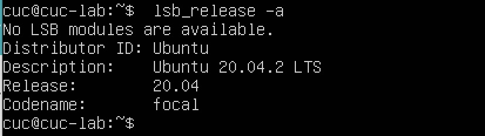

# 2022-linux-public-anisama

-----

## chap0x01实验报告

一、调查并记录实验环境的如下信息

* **当前Linux发行版基本信息**

    首先我们进入到虚拟机中，输入账号密码完成登录
    然后我们输入命令`lsb_release -a`
    回车后如下图：
    
    从图中我们可以知道当前的发行版本为 Ubuntu 20.04

&nbsp;

* **当前Linux内核版本信息**
    同样，输入命令`uname -a`
    回车后可以得到：
    
    说明如下：
            
            第一个组数字：5，主版本号
            第二个组数字：4，次版本号
            第三个组数字：0，修订版本号
            第四个组数字：65，当前内核版本(5.4.0)的第65次微调patch
            generic：此版本为通用版本
            x86_64：采用64位的CPU
            内核编译时间为：2021/01/18 17:25:17

&nbsp;

二、Virtualbox安装完Ubuntu之后新添加的网卡如何实现系统开机自动启用和自动获取IP？

我们先手动添加一下网卡，在「选中虚拟机后->设置->网络->网卡3」中启用网络连接，具体如下图：

然后我们启动虚拟机，输入命令`ifconfig -a`查看虚拟机中的所有网卡

再通过命令`ifconfig`查询在工作中的网卡

通过对比，我们发现手动添加的网卡没有开始工作

输入命令`sudo vim /etc/netplan/00-installer-config.yaml`后可以看到当前的网络配置如下：

通过`i`切换输入模式进行文本编辑添加之前的新网卡，如下图：

输入`:wq`保存编辑后的网络配置，并输入命令`sudo netplan apply`使其生效

重新启动虚拟机，输入命令`ifconfig`查询工作中的网卡，可以看到新加的网卡可以自动启动和自动获取ip地址

&nbsp;

三、如何使用`scp`在「虚拟机和宿主机之间」、「本机和远程Linux系统之间」传输文件？

* 宿主机向虚拟机传文件：
  
在选中「虚拟机->网络->网卡1->高级->端口转发」中手动添加设置如下：

在终端输入命令`scp -P 2222 ~/Desktop/hw.txt cuc@127.0.0.1:~/`可以实现

* 虚拟机发送文件给宿主机有两种方式：

（1）在终端中输入命令`scp -P 2222 cuc@127.0.0.1:~/hw.txt ~/Desktop`

(2)在虚拟机中输入命令`scp -P 22 ~/hw.txt gychg@192.168.1.6:~/Desktop`

* 本机向远程Linux系统传文件：

在本机终端中输入命令`scp ~/Desktop/hw.txt root@47.103.52.144:~/`

* 远程Linux系统向本机传文件：

在本机终端中输入命令`scp root@47.103.52.144:~/hw.txt ~/Desktop`

&nbsp;

四、如何配置SSH免密登录？

首先对端口进行设置端口映射，在选中「虚拟机->网络->网卡1->高级->端口转发」中手动添加，虚拟机端口为ssh默认22

在终端中输入命令`ssh -p 2222 cuc@127.0.0.1`连接到虚拟机(此处的ip为本机ip),结果如图：

可见此时需要输入密码才能连接，先输入`exit`退出连接
接下来，现在我们生成公钥，在终端中输入命令`ssh-keygen -t rsa`（因为之前生成过，所以这里提示的是已经存在，并问是否覆盖）

在终端输入命令`ssh-copy-id -p 2222 cuc@127.0.0.1`将生成的公钥传到虚拟机中

打开虚拟机，登录后输入命令`sudo vim /etc/ssh/sshd_config`对参数进行修改，找到`PubKeyAuthentication`将其前面的`#`删除，保存修改

输入命令`sudo /etc/init.d/ssh restart`重启一下ssh

现在回到终端，输入命令`ssh -p 2222 cuc@127.0.0.1`就可以免密登录了

&nbsp;

-----

参考资料：
* [内核版本的信息解读](https://www.cnblogs.com/still-smile/p/11597620.html)
* [Linux的文本编辑](https://www.runoob.com/linux/linux-vim.html)
* [免密登录参数修改](https://blog.csdn.net/lxyoucan/article/details/112527301)
* [scp指令](https://www.runoob.com/linux/linux-comm-scp.html)