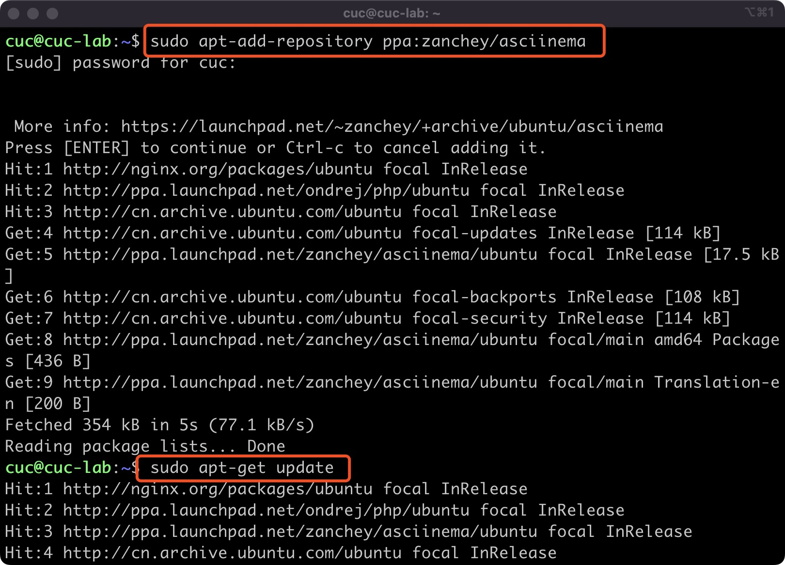
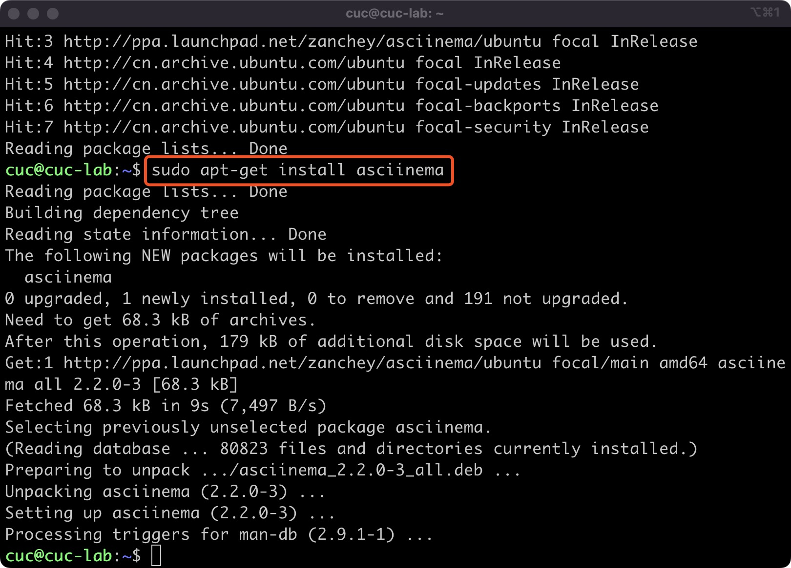

## 2022-linux-public-anisama
---
### 实验二
完成度自评：85
#### 实验要求

* 使用表格方式记录至少 2 个不同 Linux 发行版本上以下信息的获取方法，使用 asciinema 录屏方式「分段」记录相关信息的获取过程和结果

* 【软件包管理】在目标发行版上安装 tmux 和 tshark ；查看这 2 个软件被安装到哪些路径；卸载 tshark ；验证 tshark 卸载结果

* 【文件管理】复制以下
```bash
cd /tmp && for i in $(seq 0 1024);do dir="test-$RANDOM";mkdir "$dir";echo "$RANDOM" > "$dir/$dir-$RANDOM";done
```

代码到终端运行，在目标 Linux 发行版系统中构造测试数据集，然后回答以下问题：
>* 找到 /tmp 目录及其所有子目录下，文件名包含 666 的所有文件
>* 找到 /tmp 目录及其所有子目录下，文件内容包含 666 的所有文件

* 【文件压缩与解压缩】练习课件中 文件压缩与解压缩 一节所有提到的压缩与解压缩命令的使用方法

* 【跟练】 子进程管理实验

* 【硬件信息获取】目标系统的 CPU、内存大小、硬盘数量与硬盘容量

#### 实验环境
* MacOS
* Linux
* Ubuntu
* CentOS
* asciinema&其账号

#### 实验内容

##### 使用表格方式记录至少 2 个不同 Linux 发行版本上以下信息的获取方法，使用 asciinema 录屏方式「分段」记录相关信息的获取过程和结果
| 实验环境    | Ubuntu20.04    | CentOS7.7   |
| -------- | -------- | ------- |
| 安装应用   | `sudo apt install`     |   `yum install -y`      |
| 卸载应用   | `sudo apt-get remove`  | `yum -y remove`  |
| 查看路径     | `sudo apt-cache show`     | `rpm -qal|grep`    |
| 查找文件名  | `sudo find ./ type f -name "*666*" `    | `sudo find ./ -type f -name "*666*"`   |
| 查找文件内容 | `sudo grep -r "666" ./ --exculde=*.cast`| `sudo grep -r "666" ./ --exclude=*.cast` |
| zip压缩/解压缩      | `zip test1.txt/unzip -o text2.zip `| `zip test1.txt/unzip -o text2.zip ` |
| bzip压缩/解压缩      | `bzip2 text1.txt/bunzip2 text1.txt.bz2 `|`bzip2 text1.txt/bunzip2 text1.txt.bz2 | archive` |
| gzip压缩/解压缩      | `gzip -c xx.txt > xx.txt.gz/gzip -dk xx.txt.gz` |`gzip -c xx.txt > xx.txt.gz/gzip -dk xx.txt.gz`  |
| tar压缩/解压缩      | `tar -cvf xx.tar xx.txt/tar -xvf xx.tar `| `tar -cvf xx.tar xx.txt/tar -xvf xx.tar `|
|  7z压缩/解压缩      |` 7z a -t7z xx.7z ./xx.txt;7z x xx.7z -o./ `| `7za a -t7z xx.7z xx.txt;7za x 1.7z -o./`|
————————————————
版权声明：本文为CSDN博主「小可爱の书包」的原创文章，遵循CC 4.0 BY-SA版权协议，转载请附上原文出处链接及本声明。
原文链接：https://blog.csdn.net/weixin_43434932/article/details/124595277

##### 配置asciinema
* 根据asciinema官方文档Ubuntu的安装如下：
```bash
sudo apt-add-repository ppa:zanchey/asciinema
sudo apt-get update
sudo apt-get install asciinema
```
CentOS:
```
sudo yum install asciinema
```



* 文档所介绍的是使用方式如下：
>当在终端中运行`asciinema rec`时，开始记录，在发出shell命令时捕获终端的所有输出。录制完成后（通过点击Ctrl-D或键入exit），将记录到的输出将上传到 asciinema.org 网站并准备在网络上播放

##### 【软件包管理】在目标发行版上安装 tmux 和 tshark ；查看这 2 个软件被安装到哪些路径；卸载 tshark ；验证 tshark 卸载结果

* 在Ubuntu 20.04中：
安装tmux和查看安装路径
```bash
sudo apt install tmux #安装
sudo apt-cache show tmux #查看路径
```
[](https://asciinema.org/a/B5HD8JVT6LIfz4ExhFSALjXn6)

安装tshark、查看安装路径、卸载tshark和验证tshark卸载结果
```bash
sudo apt install tshark #安装
sudo apt-cache show tshark #查看路径
sudo apt-get remove tshark #删除软件包保留配置文件
sudo apt-get purge tshark #删除软件包和配置文件
which tshark #验证
```
[](https://asciinema.org/a/aeOXBCIQ7d78pbvbWUxxGRGF2)

* 在CentOS7.7中：
安装tmux和查看安装路径
```bash
yum install tmux #安装
rpm -qal|grep tmux #查看路径
```
[](https://asciinema.org/a/R3AhnDPYcTjbrdP4z2g3DvzQY)
[](https://asciinema.org/a/eKW2EsJ6B9GIt7cSRmDvWwt2s)

tshark的安装、路径和卸载
CentOS中没有tshark包，而wireshark包含tshark，所以直接下载wireshark包
```bash
yum install wireshark #安装
rpm -qal|grep wireshark #路径
yum -y remove wireshark #卸载
```
[](https://asciinema.org/a/8WJRYLeP9jrm9jipjJAvRSogk)

##### 【文件管理】复制以下
```bash
cd /tmp && for i in $(seq 0 1024);do dir="test-$RANDOM";mkdir "$dir";echo "$RANDOM" > "$dir/$dir-$RANDOM";done
```

代码到终端运行，在目标 Linux 发行版系统中构造测试数据集，然后回答以下问题：
>* 找到 /tmp 目录及其所有子目录下，文件名包含 666 的所有文件
>* 找到 /tmp 目录及其所有子目录下，文件内容包含 666 的所有文件

* 在Ubuntu20.04中：
```bash
sudo find ./ -type f -name "*666*" #找到`/tmp`目录及其子目录下名字带有"666"的文件
sudo grep -r "666" ./ --exclude=*.cast #找到`tmp`目录及其子目录下，内容有"666"的文件;".cast"文件在asciinema录制时产生乱码，而利用"--exclude"可以解决这个问题
```
[](https://asciinema.org/a/DuKGY6wQ7SS1wdGRRlFgw0UuO)

* 在CentOS7.7中：
```bash
sudo find ./ -type f -name "*666*" #找到`/tmp`目录及其子目录下名字带有"666"的文件
sudo grep -r "666" ./ --exclude=*.cast #找到`tmp`目录及其子目录下，内容有"666"的文件
```
[](https://asciinema.org/a/7vOx2PAbTORc7HMRMjaZ3RInc)
[](https://asciinema.org/a/VZvFN6L9yBNaKAbajUar3hLKy)

##### 【文件压缩与解压缩】练习课件中 文件压缩与解压缩 一节所有提到的压缩与解压缩命令的使用方法
* 在Ubuntu中：
创建文件 test1.txt test2.zip
并用vim给text1.txt增加点内容
* zip
```bash
sudo apt-get install zip  #安装zip,unzip
sudo apt-get install unzip  
zip test1.txt
unzip -o text2.zip #解压缩
```

* bzip
```bash
bzip2 text1.txt
bunzip2 text1.txt.bz2
```
[](https://asciinema.org/a/wcLrfk32qKnqahLgzQ0tulXyw)
* gzip
```bash
gzip -c xx.txt > xx.txt.gz 
gzip -dk xx.txt.gz
```
[](https://asciinema.org/a/HDFhxgMfGdry5hUGKPtBFCkEr)
* tar
```
tar -cvf xx.tar xx.txt
tar -xvf xx.tar
```

* 7z
```
sudo apt install p7zip-full
7z a -t7z xx.7z ./xx.txt
7z x xx.7z -o./
```
[](https://asciinema.org/a/4vz3ZAzJFxpqZEHP3NmK8Rf7r)

* rar
```
sudo rar a test1.rar test1.txt
sudo rar x test1.rar
```

* 在CentOS7.7中：
`zip,bzip2,gzip,tar`的命令都一样

* 7z
```bash
7za a -t7z 1.7z 1.txt #压缩
7za x 1.7z -o./ #解压缩
```

##### 【跟练】 子进程管理实验

* Ubuntu 20.04
[](https://asciinema.org/a/soZMVoQRoBaym5XCnRWCYI8e9)

* CentOS

##### 【硬件信息获取】目标系统的 CPU、内存大小、硬盘数量与硬盘容量

* Ubuntu20.04
目标系统的CPU
    * 查看CPU
    ```bash
   grep "model name" /proc/cpuinfo |awk -F ':' '{print $NF}'
    #CPU型号
    cat /proc/cpuinfo | grep "physical id" | uniq | wc -l
    #CPU个数
    cat /proc/cpuinfo | grep "cpu cores" | uniq 
    #CPU核数
    ```  \

    * 内存
    ```bash
    cat /proc/meminfo | grep MemTotal
    ```  
    * 硬盘
    ```bash
    sudo fdisk -l | grep Disk 
    ```  
[](https://asciinema.org/a/mQ67zBVSmx8bFTJ61xTfuxjL6)
* CentOS
    * CPU大小
    ```bash
    cat /proc/cpuinfo |grep "model name" && cat /proc/cpuinfo |grep "physical id"
    ```
    * 内存
    ```bash
    cat /proc/meninfo |grep MemTotal #内存大小
    free -m #查看内存使用量和交换区使用量
    ```
    * 硬盘
    ```bash
    fdisk -l |grep Disk #硬盘大小
    df -h #查看各分区使用情况
    ```
  
#### 实验遇到的问题
1.视频如何放markdown且播放正常，由章节习题讨论区得知可以在asciinema中的share里直接得到完整的视频markdown代码，好方便啊

2.CentOS使用apt下载安装报错`-bash：apt command not found`,CentOS使用yum下载