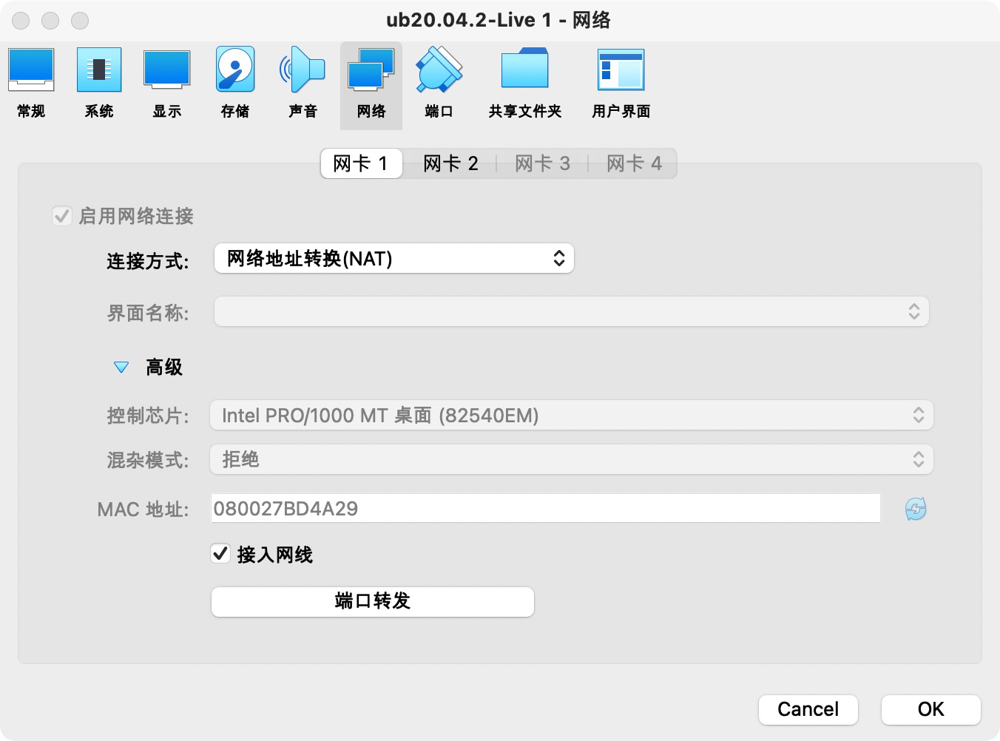
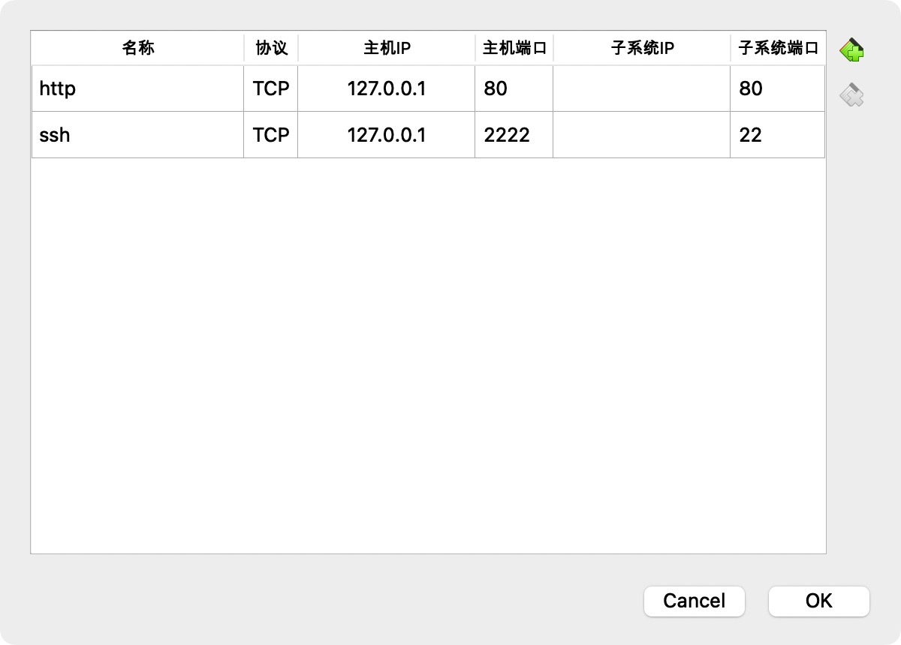

## 2022-linux-public-anisama

---

### chap0x05实验报告
完成度自查：75
#### 实验要求
* 在一台主机（虚拟机）上同时配置Nginx和VeryNginx
    * VeryNginx作为本次实验的Web App的反向代理服务器和WAF
    * PHP-FPM进程的反向代理配置在nginx服务器上，VeryNginx服务器不直接配置Web站点服务
* 使用Wordpress搭建的站点对外提供访问的地址为： http://wp.sec.cuc.edu.cn
* 使用Damn Vulnerable Web Application (DVWA)搭建的站点对外提供访问的地址为： http://dvwa.sec.cuc.edu.cn

#### 安全加固要求
* 使用IP地址方式均无法访问上述任意站点，并向访客展示自定义的友好错误提示信息页面-1
* Damn Vulnerable Web Application (DVWA)只允许白名单上的访客来源IP，其他来源的IP访问均向访客展示自定义的友好错误提示信息页面-2
* 在不升级Wordpress版本的情况下，通过定制VeryNginx的访问控制策略规则，热修复WordPress < 4.7.1 - Username Enumeration
* 通过配置VeryNginx的Filter规则实现对Damn Vulnerable Web Application (DVWA)的SQL注入实验在低安全等级条件下进行防护

#### VeryNginx配置要求
* VeryNginx的Web管理页面仅允许白名单上的访客来源IP，其他来源的IP访问均向访客展示自定义的友好错误提示信息页面-3
* 通过定制VeryNginx的访问控制策略规则实现：
    * 限制DVWA站点的单IP访问速率为每秒请求数 < 50
    * 限制Wordpress站点的单IP访问速率为每秒请求数 < 20
    * 超过访问频率限制的请求直接返回自定义错误提示信息页面-4
    * 禁止curl访问

#### 实验环境
* 硬件设备：MacOS
* 软件环境：
  * Nginx
  * VeryNginx
  * Wordpress
  * Damn Vulnerable Web Application

#### 实验内容

本实验代码在终端中执行，且终端已经连接了虚拟机

##### 0.更改主机的hosts文件并完成NAT的映射
```bash
vim /etc/hosts #查看hosts文件,i进入编辑模式后，添加下方代码，完成后保存
127.0.0.1 vn.sec.cuc.edu.cn
127.0.0.1 dvwa.sec.cuc.edu.cn
127.0.0.1 wp.sec.cuc.edu.cn
```
在VB管理器-设置-网络NAT选取高级、接入网线，并手动添加端口完成NAT的映射


##### 1.安装nginx

* 在nginx官网的文档中找到Ubuntu下在nginx的代码，并在终端中依次运行
```bash
sudo apt install curl gnupg2 ca-certificates lsb-release ubuntu-keyring #Install the prerequisites
curl https://nginx.org/keys/nginx_signing.key | gpg --dearmor | sudo tee /usr/share/keyrings/nginx-archive-keyring.gpg >/dev/null #Import an official nginx signing key so apt could verify the packages authenticity. Fetch the key
gpg --dry-run --quiet --import --import-options import-show /usr/share/keyrings/nginx-archive-keyring.gpg #Verify that the downloaded file sudo 
echo "deb [signed-by=/usr/share/keyrings/nginx-archive-keyring.gpg] \
http://nginx.org/packages/ubuntu `lsb_release -cs` nginx" \
    | sudo tee /etc/apt/sources.list.d/nginx.list
sudo apt update
sudo apt install nginx
```
* 验证nginx安装完成，查看其版本号
```bash
sudo nginx -t
nginx -V
```
* 配置文件
```bash
sudo ufw app list #查看可用配置文件
sudo ufw allow 'Nginx HTTP' #启用功能
sudo ufw status #验证更改
```

##### 2.安装VeryNginx

* 将VeryNginx仓库克隆到本地的目录里,进入该仓库目录，执行命令
```bash
cd VeryNginx
python3 install.py install
```
一开始使用的命令是`python install.py install`，结果报错说找不到`python`,猜想自带的是`python3`，验证得猜想正确
* 安装失败，根据官方文档所述，我们需要安装依赖
```bash
sudo apt update
sudo apt install gcc
sudo apt install make
sudo apt install libpcre3-dev zlib1g zlib1g-dev libssl-dev
```

* 配置文件
```bash
sudo vim /opt/verynginx/openresty/nginx/conf/nginx.conf #修改配置如下：
include /opt/verynginx/verynginx/nginx_conf/in_external.conf;
include /opt/verynginx/verynginx/nginx_conf/in_http_block.conf;
include /opt/verynginx/verynginx/nginx_conf/in_server_block.conf; #分别加到http配置块的外部、内部以及server配置块内部
```

##### 3.安装PHP

* 先通过`vim installPhp.sh`创建文件并且写入下方代码，按`:wq`保存
```bash
apt update  #更新
apt install language-pack-en-base software-properties-common -y #解决语言冲突和中文乱码
locale-gen en_US.UTF-8 #语言环境
apt-get install vim -y #安装vim
LC_ALL=en_US.UTF-8 add-apt-repository ppa:ondrej #php使用ppa安装php
apt update #再次更新
apt install php7.4 php7.4-fpm php7.4-cli php7.4-dev php7.4-redis php7.4-mysql php7.4-curl php7.4-xml php7.4-json php7.4-gd php7.4-mbstring php7.4-zip php7.4-bcmath -y #安装php和相关组件
```
* 然后执行命令`sh installPhp.sh`进行安装
* 用`php -v`来查看php版本并确认php安装成功

##### 4.安装MySQL

```bash
sudo apt update #更新源
sudo apt install mysql-server #安装mysql服务
sudo mkdir -p /data/www/wp #创建文件夹存放解压后的wordpress数据

```

##### 5.安装WordPress
```bash
sudo wget https://wordpress.org/latest.tar.gz #在官网下载安装包
sudo tar -zcvf latest.tar.gz ./* #解压
sudo mkdir -p /var/www/html/wp.sec.cuc.edu.cn
sudo cp wordpress /var/www/html/wp.sec.cuc.edu.cn
```
* 创建数据库
```bash
# 登录
sudo mysql
# 建库
CREATE DATABASE wordpress DEFAULT CHARACTER SET utf8 COLLATE utf8_unicode_ci;
# 新建用户
create user 'rock'@'localhost' identified by 'Ani$123456';
# 授权
grant all on wordpress.* to 'rock'@'localhost';
```
* 配置文件
```c++
// ** MySQL settings - You can get this info from your web host ** //
/** The name of the database for WordPress */
define('DB_NAME', 'wordpress');

/** MySQL database username */
define('DB_USER', 'username');

/** MySQL database password */
define('DB_PASSWORD', 'password');

/** MySQL hostname */
define('DB_HOST', 'localhost');

/** Database Charset to use in creating database tables. */
define('DB_CHARSET', 'utf8');

/** The Database Collate type. Don't change this if in doubt. */
define('DB_COLLATE', '');
```

##### 6.安装DVMA
```bash
git clone https://github.com/digininja/DVWA.git #克隆DVMA库
sudo mkdir /var/www/html/dvma.sec.cuc.edu
sudo mv DVMA/* /var/www/html/dvma.sec.cuc.edu
```
* 配置PHP
```bash
sudo mv config.inc.php.dist config.inc.php

# 默认配置：
$_DVWA[ 'db_database' ] = 'dvwa';
$_DVWA[ 'db_user' ] = 'dvwa';
$_DVWA[ 'db_password' ] = 'p@ssw0rd';

# 修改php-fpm文件
sudo vim /etc/php/7.4/fpm/php.ini 

display_errors: Off
safe_mode: Off
allow_url_include: On
allow_url_fopen: On

#重启php
systemctl restart php7.4-fpm.service

#授权给www-data用户和组
sudo chown -R www-data.www-data /var/www/html/dvwa.sec.cuc.edu.cn
```

* 配置MySQL
```bash
sudo mysql
CREATE DATABASE dvwa DEFAULT CHARACTER SET utf8 COLLATE utf8_unicode_ci;
CREATE USER 'dvwa'@'localhost' IDENTIFIED BY 'p@ssw0rd';
GRANT ALL ON dvwa.* TO 'dvwa'@'localhost';
exit
```

##### 实验要求
* 使用VeryNginx反向代理
```bash
sudo vim /etc/nginx/sites-available/wp.sec.cuc.edu.cn #创建文件
```
```bash
server {
	listen 8001 default_server;

    # 设置网页的根目录等相关内容
    root /var/www/html/wp.sec.cuc.edu.cn;
    index index.php index.html index.htm index.nginx-debian.html;
    server_name wp.sec.cuc.edu.cn;

    location / {
        # try_files $uri $uri/ =404;
        try_files $uri $uri/ /index.php$is_args$args;

    }
    # 配置反向代理
    location ~ \.php$ {
      include snippets/fastcgi-php.conf;
      fastcgi_pass unix:/var/run/php/php7.4-fpm.sock;
    }

    location ~ /\.ht {
        deny all;
    }
}
```

* 使用IP地址方式均无法访问上述任意站点，并向访客展示自定义的友好错误提示信息页面-1

* Damn Vulnerable Web Application (DVWA)只允许白名单上的访客来源IP，其他来源的IP访问均向访客展示自定义的友好错误提示信息页面-2

#### 参考资料
[Ubuntu安装nginx教程](https://blog.csdn.net/bb159632478/article/details/109450944)
[nginx官方文档关于安装下载的部分](http://nginx.org/en/linux_packages.html#Ubuntu)
[Ubuntu安装PHP](https://www.jianshu.com/p/164e9e02bfc4)
[Ubuntu安装VeryNginx](https://www.jianshu.com/p/6c9c38898b48)
[VeryNginx官方文档关于安装下载的部分](https://github.com/alexazhou/VeryNginx/blob/master/readme_zh.md)
[Ubuntu解压tar.gz格式文件](https://blog.csdn.net/amnesiagreen/article/details/106324694)
[MySQL官方文档关于Linux系统apt下载](https://dev.mysql.com/doc/mysql-apt-repo-quick-guide/en/)
[Ubuntu安装MySQL](https://blog.csdn.net/m0_67394002/article/details/124090399)